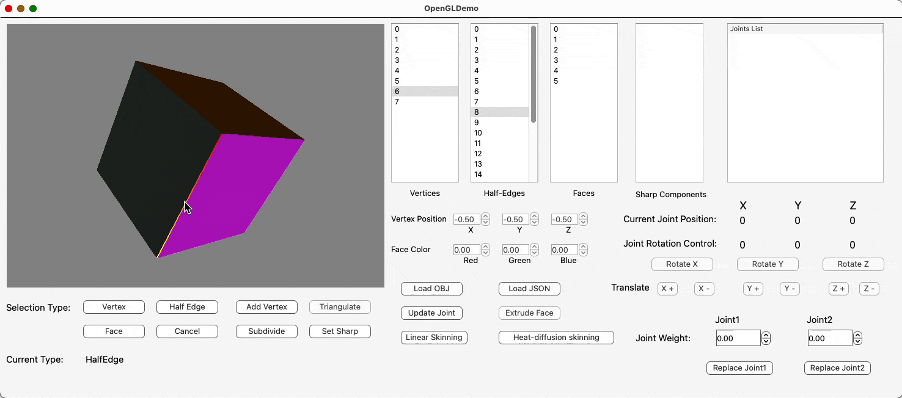
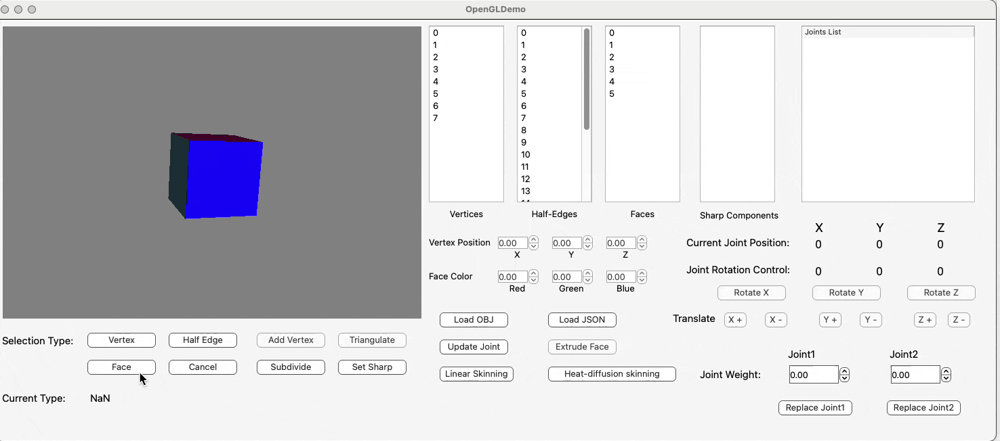
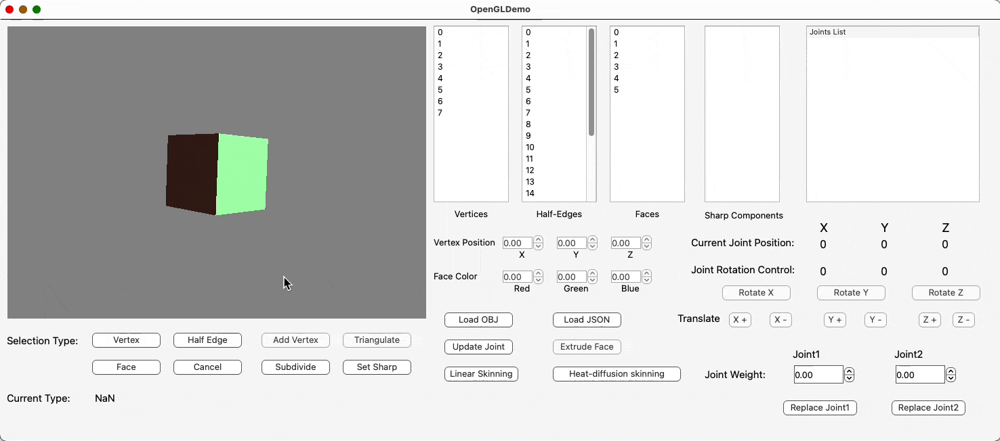
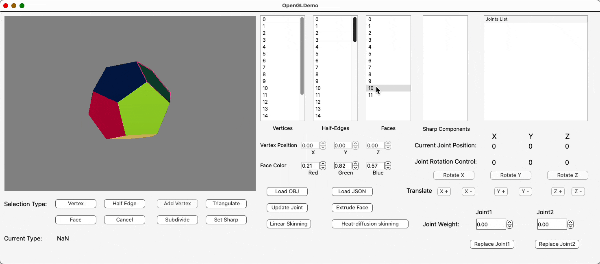

# MircoMaya
A mesh editor mimicking the functions in the style of Autodesk Maya or Blender. Support loading OBJ files and corresponding JSON skeleton file, and modifying the mesh with the half-edge data structure.
## Supported Functions
### Loading OBJ files and JSON skeleton

### Topology Editing Functions
Adding a Vertex as the midpoint of the current selected HalfEdge.

Triangulate a selected face in the mesh.  

### Catmull-Clark Subdivision

### Extruding Faces

### Skeletons and Skinning
After binding the mesh and skeleton, the mesh can deform based on the skeleton with selected control joint. The weight influence of the joint on each vertex can be modified or replaced. [Youtube](https://www.youtube.com/watch?v=PMA9sk4jaMo)

